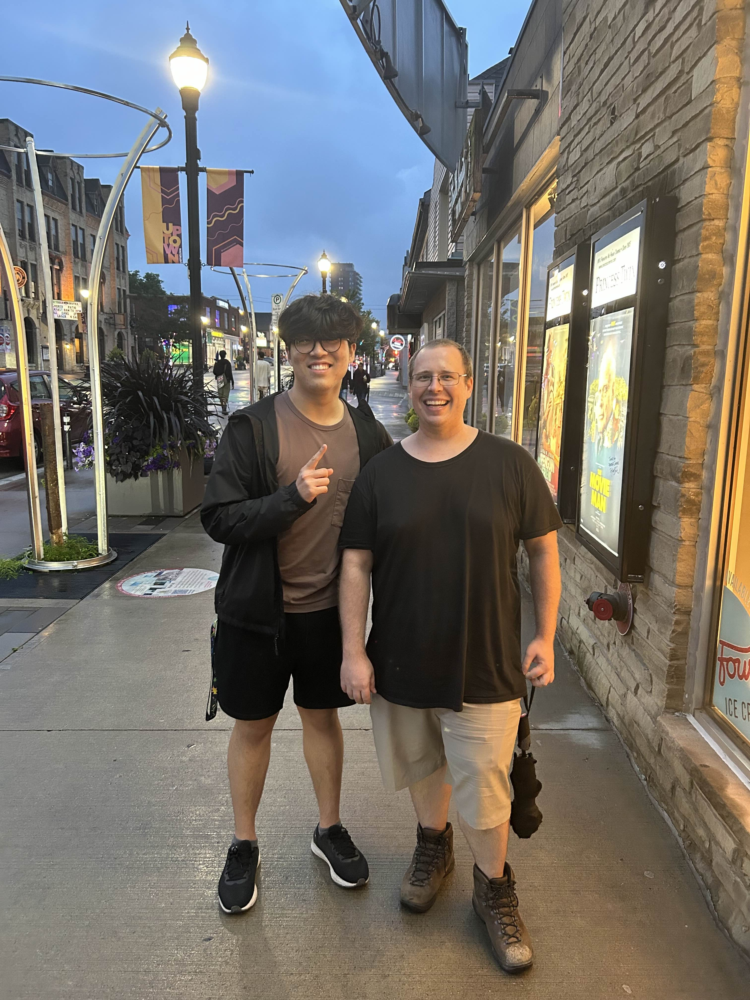

In [true probablyalex fashion](https://probablyalexzhu.github.io/blog/2a-random-updates/), it's been a while since my last blog, and I've got some time to kill at an airport (I finished this two weeks later). So here's a quick update on what's going on in my life.  

## ~~Cali~~ Singapore or bust
You might be wondering why I'm at an airport 5 days before co-op starts; that's becuase I'm travelling to Singapore for my second co-op! I landed a position at [GALAMAD Aerospace](https://galamad.space/), a Singaporean space startup focusing on the development of a 16u CubeSat platform. I'll be working as an electronics engineer, where I'll be designing PCBs, manufacturing them inhouse, and prototyping them. As I finish this blog, I am nearing the end of my second week, where I have already learned so much. I already love the team and really look forward to the months ahead.

## It only gets easier from here

When I asked every upper year / lurked discord servers for opinions, everyone said that 1B was *bad*.

This was very true.

The gap between 1A and 1B is big; while not impossible, it is hard. 5 full load courses + stupid econ is a legitmate challenge of time juggling. Rotating 8:30am labs, followed by classes from 12:30-6:20pm meant near 10 hour days on Tuesday to Thursday. Then you'd go home and complete whatever quiz (out of 3) was due that day/tomorrow. By the end of the week, you had no more energy to study (sorry MATH119 quiz). But we did basically have a 4-day weekend to compensate. Did I make full use of those 4 days? Of course not.

The lack of a reading week before midterms was seriously detrimental; you more or less only had the night before to study for each midterm. That alongside with some transition from my poor 1A studying habits is probably why I did so poorly on midterms. Finals season felt a little different this time around, it felt like I couldn't focus as hard as I did compared to 1A finals. But that might have to do with the fact that every 1B final felt like a matter of life or death. The entire cohort was genuinely concerned for the worst case scenario where we fail the term; thankfully I and many others will be progressing to 2A.

It only gets easier from here... right? (The same upper years have mixed opinions on 2A and 2B. So, we'll see.)

## Recent jammers

Once again, I found myself listening to more YouTube sets than songs during 1B finals. Here are all of them.

### Swedish House Mafia @ Tomorrowland, 2024

<iframe width="500" height="281"
src="https://www.youtube.com/embed/dSK13X9oGi8">
</iframe>

This term's pre-exam walk hype music. I understand why SHM are so good now.

<u>Notable timestamps:</u>
 
**0:12** Steve Angello ft. The Presets - Remember (Intro Edit)
 
**2:51** Swedish House Mafia ft. Tinie Tempah - Miami 2 Ibiza
 
**5:40** Swedish House Mafia ft. Pharrell vs. Nari & Milani - One (Your Name) vs. Atom (Swedish House Mafia Bootleg)
 
**25:50** Steve Angello & Dimitri Vangelis & Wyman vs. Axwell Λ Ingrosso & Kristoffer Fogelmark - Payback vs. More Than You Know (Swedish House Mafia Mashup)
 
**27:45** Booka Shade vs. Ivan Gough & Feenixpawl & Axwell ft. Georgi Kay - Love Inc vs. In My Mind (Axwell Mashup) w/ Axwell Λ Ingrosso ft. Trevor Guthrie - Dreamer (Acappella)
 
**33:14** Swedish House Mafia - Ray Of Solar w/ Fred again.. & Swedish House Mafia ft. Future - Turn On The Lights Again..

### Alesso @ Tomorrowland, 2024

<iframe width="500" height="281"
src="https://www.youtube.com/embed/07p-uHtAaOo">
</iframe>

Less timestamps for this one mostly because its just a pretty high quality set. I would've timestamped almost the entire set.

<u>Notable timestamps:</u>
 
**24:07** KAAZE ft. Alina Pozi - Papi w/ The Prodigy - Smack My Bitch Up
 
**29:15** Yes - Owner of a Lonely Heart (Alesso & John Alto Remix)
 
**37:05** David Guetta & Alesso - Never Going Home
 
**40:15** Gotye ft. Kimbra - Somebody That I Used To Know (SIDEPIECE Treat)

### Gryffin DJ Set @ Kauai, Hawaii, 2023

<iframe width="500" height="281"
src="https://www.youtube.com/embed/0fStWP79Z5A">
</iframe>

Very nice chill vibe that strays away from Gryffin's typical energetic sets.

<u>Notable timestamps:</u>
 
**13:20** Gryffin & Bipolar Sunshine - Whole Heart (Last Heroes Remix)
 
**16:35** Gryffin & Matt Maeson - Lose Your Love
 
**19:02** Gryffin ft. Elley Duhe - Forever (VIP)
 
**33:15** Gryffin & salem ilese - Glitch In The Simulation
 
**39:23** Gryffin & Jason Ross ft. Calle Lehmann - After You
 
**42:03** Gryffin & Illenium ft. Daya - Feel Good w/ John Martin - Cry

### Fred Again Live from Arun's Roof, London, 2024

<iframe width="500" height="281"
src="https://www.youtube.com/embed/6MAzUT1YhWE">
</iframe>

Honestly, I don't remember anything notable to timestamp. But this is a very nice set to listen to.

 
As I currently live my best life in Singapore, I certainly won't be slacking off all the time- I'm getting ready to cook up some keyboards. Wishing you a good co-op/study term that's just as enjoyable as mine.
