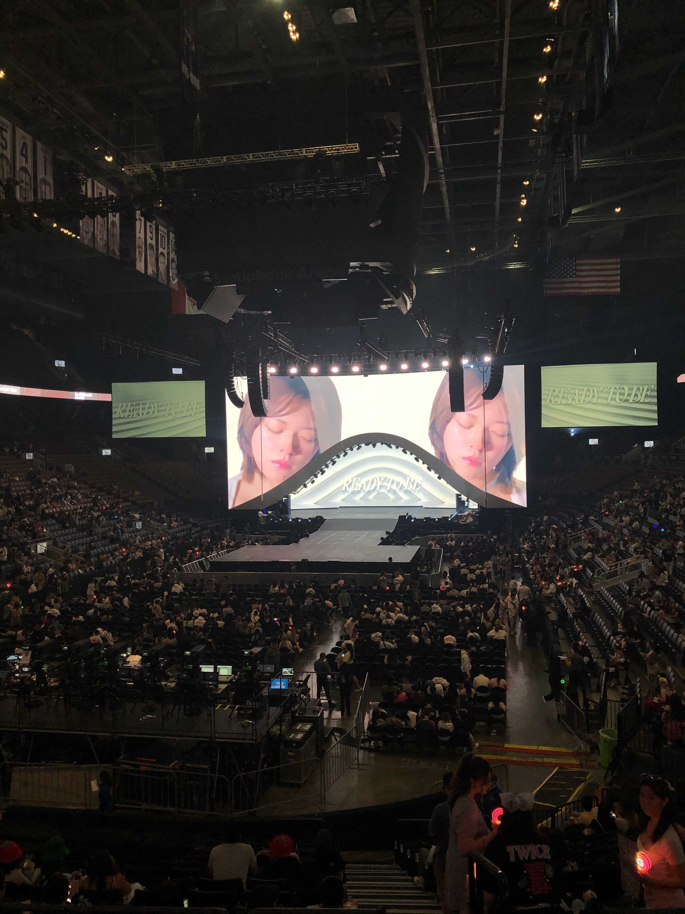
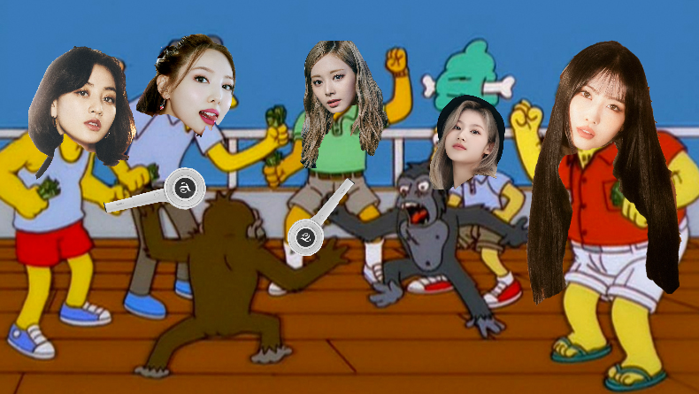
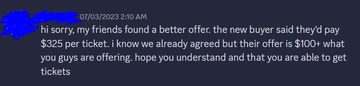
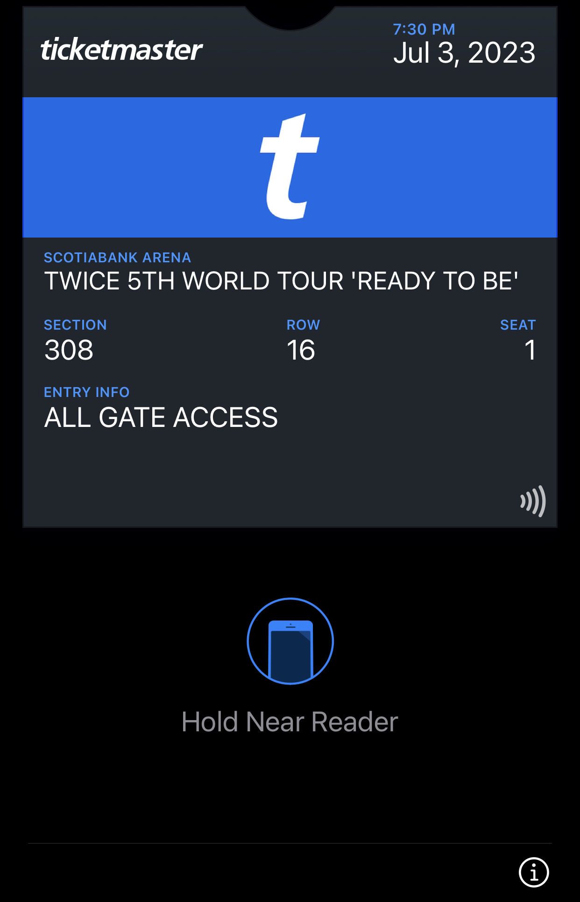
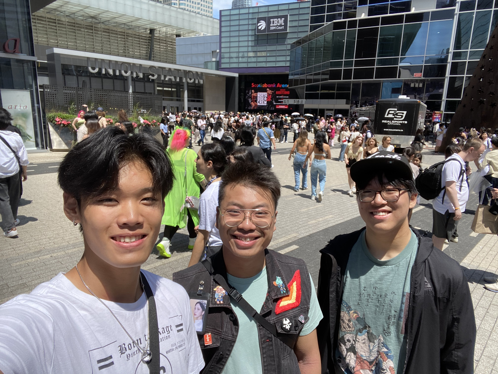
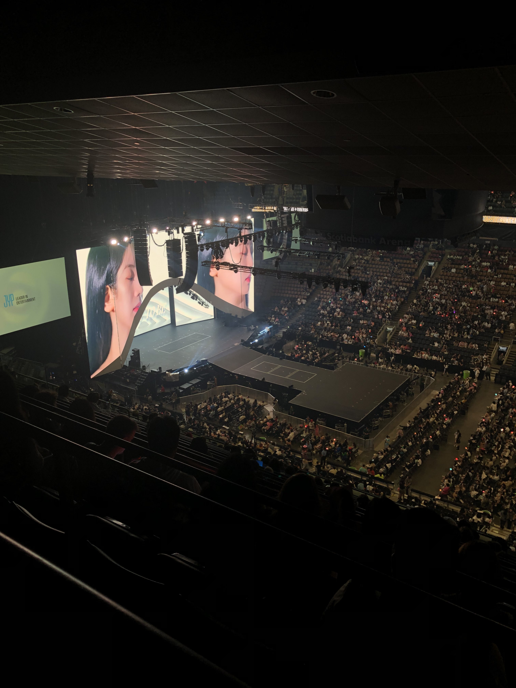
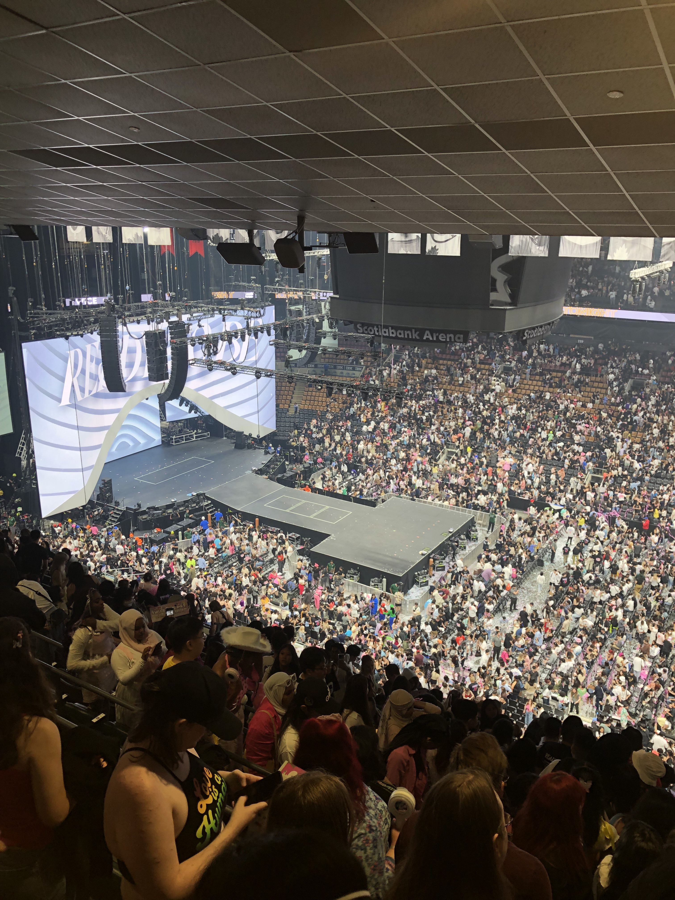

If you told 12-year-old Nathan that six years in the future, he would be screaming the lyrics of TWICE’s Likey live at their concert, he would’ve probably called you crazy + stupid and cussed you out. And honestly, I don't even blame him, because six months ago I would’ve answered the same.

## Do I go to the concert… yes or yes
When I first saw the announcement for TWICE’s world tour that included a Toronto stop, I asked my friends if they wanted to go as a joke. I knew that it would be impossible to get tickets, and I really didn't see myself as that big of a TWICE fan in the first place. I really only listened to their most popular title tracks. As well, I wanted my first concert to be for an artist that I really like and support. The only other two concerts I considered going to were JPEGMAFIA’s and Kendrick Lamar’s concerts in 2022 (I should’ve tanked the hefty price tag for Kendrick’s concert).

Seeing “TWICE concert tickets for sale!” Instagram stories toyed with my mind, but I held back from sending a message to any sellers. But as the concert grew closer and closer, the thought of actually going to the concert also grew. Until I did send a message. Then a few more. Although these inquiries didn’t lead to anything, I subconsciously decided that I was going to find a ticket to this damned concert, even up until the day before the first show when most tickets were sold out for both days. I would be banking on last-minute sellers dropping their prices for a quick sale, a strategy that I had only heard of but had never participated in.

Something about being an Asian teen male going to a TWICE concert alone didn't sit right in my head, so I needed a friend to help make it less awkward. One problem; my usual suspects were unavailable. I asked everyone I knew, even light K-pop listeners, but was met with unfortunate rejections. At this point, I was seriously contemplating posting an Instagram story begging someone to come with me, until another lone Asian teen male had posted an Instagram note pleading for tickets. Introducing Tyler; a Grade 11 from my school who I knew of, but probably didn't know of me. A quick DM and we joined forces in our search. Most importantly, I had succeeded in my search for a friend to go with. (The first time Instagram notes have served a purpose!)

## Free-for-all deathmatch

As mentioned earlier, tickets were hard and scarce to find, especially with Tyler’s $200 budget to work with. Ticketmaster and resale sites had 300-level tickets at over $200 CAD; I knew that I could find a better deal. Taking the advice of a friend, I joined the fanmade TWICE Toronto Discord server, where other fans were selling their tickets. Here, I spent the next 36 hours watching the #tickets channel like a hawk. I used the first day of the concert as a gauge for Day 2 prices, where there were quite a few good deals. I was hoping those deals would also appear the next day. It didn’t help that there was another fan who was looking for the exact same thing as me- two tickets for $200 or less. Whatever [WTS] (want to sell) thread I was in, they were also in. Fist-fighting for tickets, one could say.

After monitoring Day 1 ticket sales (at a family friend’s dinner), something clicked in my head that I had to get tickets that night, or else it would be too late. And it wasn’t even like there weren’t any tickets; Ticketmaster was selling 100-level seats for about $233 each, a pretty good deal for the section, albeit above our friend’s budget. Nevertheless, I got home at around 10pm and sat at my PC for the next 4 hours staring at the tickets thread. It reached a point where I was necroing month-old threads, dm-ing the OPs asking if they were still selling. (No one replied.)  I was also really lowballing, asking $400 VIP w/ soundcheck ticket sellers if they could do $200. (No one replied.) But as the night wore on, fewer and fewer new threads and messages started to appear.

Then, at midnight, I get a notification for a new thread.

**[WTS] selling 4 tickets for section 109, $300 negotiable!!!**

I knew that this could be the one. I immediately sent a message to the OP, initially offering $500 for the two tickets. I used the Ticketmaster tickets as leverage, saying I found “some tickets for lower than $500”, even though they weren’t as good (but the seller didn’t know that). I managed to haggle it down to $450 for the pair, and we agreed on the deal. I decided to let the seller figure out how to process the payment through PayPal, figuring it would take them a while as it took them a bit to reply to my messages in the first place. But 40 minutes is a really long time, so I sent them a message asking them if everything was all right.

Was it messed up? Yes. Was I pissed off? Yes, and I had to express that in a way that was polite and did not involve expletives.

Pretty good, if I say so myself.

It actually turned out that the seller’s friends were supposedly yelling at them, so I assumed they got peer-pressured into canceling the transaction. I let them go by letting them know it's bad practice to do things like that and asked them to pass the message along to their friends.

So, now I’m back at square one. I’m pissed, it's 2:15 in the morning, I need to sleep soon,  and I have no tickets. What else can I do but wait?

Less than 15 minutes later, another new thread notification popped up.

**[WTS] two tickets section 308 $150 each**

It was like after all the trouble I went through, God himself has come down and given me a blessing. However, I was immediately skeptical because the post didn't follow the mandatory post guidelines of including a watermarked screenshot, which was pretty clearly defined in the tickets channel. I sent a DM anyways, scam or not, asking for a screenshot of the tickets. The seller replied with watermarked screenshots of the tickets, which made me feel a little bit better. We agreed on $300 and worked on payment. For some reason, Ticketmaster decided to have a fit; the seller couldn’t transfer their tickets at that moment. So, we agreed to transfer them the next day, after I made the seller promise me they wouldn’t dupe me like the previous seller. (No way in hell I was doing that again.)

I woke up in the morning, ate breakfast, stuffed everything I needed into my pockets, borrowed some portable chargers (that we didn’t even use [thanks Linxi]), bought some backup granola bars, picked up Tyler, and drove down to Finch station. Parking was free because of the Canada Day holiday. We hopped on Line 1 down to Union Station, seeing a few other ONCEs (the name for TWICE fans) headed down just like us. Getting off, I left my AirPods case on the subway by accident, which was unfortunate (manageable losses + I replaced them the day after). Undeterred, I completed the ticket transfer with our seller as we walked out of the station.

And at long last, I had the tickets.

## Like vultures circling their prey
We arrived at Scotiabank Arena around noon. One of the unintentional perks of joining the TWICE Toronto Discord was that we found out about freebies. Like any sane person, the only reason why we were there so early was for these freebies. So, for the next two hours, we hung around Maple Leaf Square, beelining towards even the smallest group of people surrounding someone. We also bumped into Mr. Li, who was in line for the merch. He bought a tour T-shirt.

The time is now 2pm, with the concert starting at 7:30pm. Five hours passed in a mix of sitting in Union Station and charging our phones, eating food, and watching the play dance that was being hosted. Even though we didn’t know half the songs (we’re 4th gen babies 😥), it was still enjoyable to watch Toronto’s K-pop community come out and show off their dance skills. My favourite was a performance of Nayeon’s POP! by two young performers.



At 6:30, we decided to head toward the gates to start lining up. To our surprise, Gate 1 (the main gate) had no lineup at all. Our lucky day we thought, until security took away our water bottles. We had been told that clear plastic water bottles were allowed, and they were; people who entered through other gates had brought theirs in. Thus began our wild goose chase for cups and a water fountain; we asked maybe 10 different food stands for cups, all of which said no. Thankfully, Guest Services bailed us out by getting us the cups that we were supposedly able to get at these food stands. (Inconsistency seemed to be the name of the game at Scotiabank Arena that night.)

After collecting one last freebie, we made our way up to the 300 level for our seats. And although they weren’t the 100-level seats that we were initially promised, it was still pretty damn good for $150. We sat down and waited for what felt like the longest and shortest 30 minutes of my life. Sometimes the silence would be broken by a JYPNation video showcasing their groups. (I swear SKZ got the loudest cheer?)

The clock strikes 7:30. The visuals on the stage screens change. Music starts playing. A loud cheer erupts. It is happening.

## Ready to be
For the next 2 hours and 30 minutes, Mr. “I really didn't see myself as that big of a TWICE fan” screams his lungs out to basically every song. And although I botched all the Korean pronunciations, you can bet I screamed every English lyric.

I won’t talk about every song; you can find the [setlist here](https://open.spotify.com/playlist/25zh9aTxpO7B36NQmFJqO0?si=ef5a382492c64ee4). I’ll list out my highlights of the concert instead. (I would put concert clips in, but I need to protect my image...)
* The first TWICE release that I experienced was MOONLIGHT SUNRISE, their second English single. Given that it's my second highest listened-to TWICE song (126 streams), I think I perfectly sang the entire song. We received a compliment from the fans beside us, saying our singing was “really good”.
* My throat started giving out 30 minutes in. I don't know how the rest of the audience did it; I started clapping in lieu of screaming/cheering. But when I could scream, I screamed.
* Every few songs, there was a break to allow the group to rotate into their solo stages. During these breaks, I sprinted to refill our water cups. Probably the reason why my voice was only dead for a few days.
* God forbid why everyone started barking when Dahyun was on camera/speaking.
    * Did I bark? Yes.
* I came back in time for the Mina and Momo solo stages. Need I say more?
* The live band sounded incredible, and their epic build-up to Feel Special was probably my favourite moment of the night.
* It was insane to me that their most popular songs were stitched together into a live medley. (YES or YES to Heart Shaker in the set list) Why did they start Likey at the rap??? The entire arena was ready for the chorus of the song 😭
* Shoutout to the guy who started twerking when he was on camera for the dance battle.  

## Celebrate
The concert ends.

The post-concert depression immediately hits like a truck. Looking around the now-illuminated arena, the only reaction I could conjure was “Damn.” I just watched one of the greatest (if not the greatest) K-pop girl group perform all of their hit songs in Canada, a country they had never toured before. And I knew every song, screaming whatever lyrics I could. *That* was my very first concert, my first “real” music experience, my first K-pop experience. And it was one that I will never forget.

As we start making our way back, I take note of all the ONCEs we pass by on our way to Union Station. We replay our concert clips on the subway, laughing at the audio of a few specific clips (Take a guess of which performances). We listen to the set one last time on the car ride, knowing that we’ll never scream the lyrics louder ever again. After dropping off Tyler, I arrive home at around 11pm, immediately rushing to hide my freebies from my parents. And thus comes to an end to probably the craziest 36 hours of my life. 

Would I do it again? Yes. 