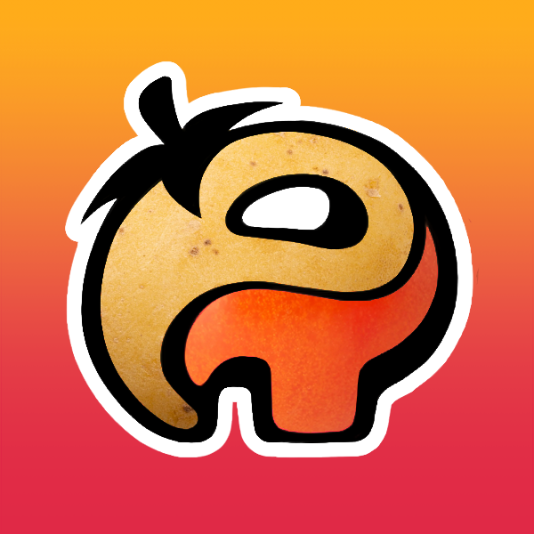
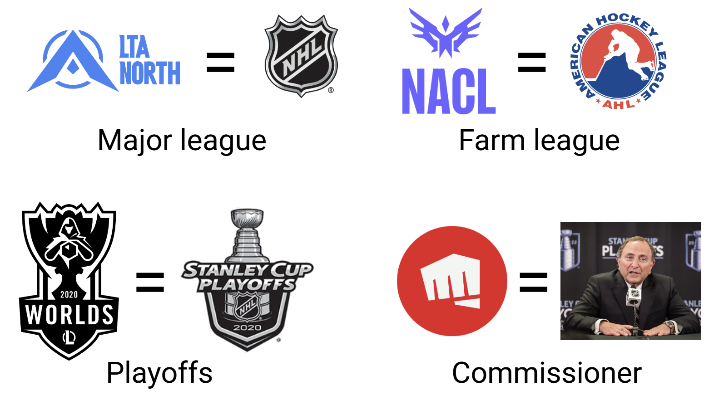
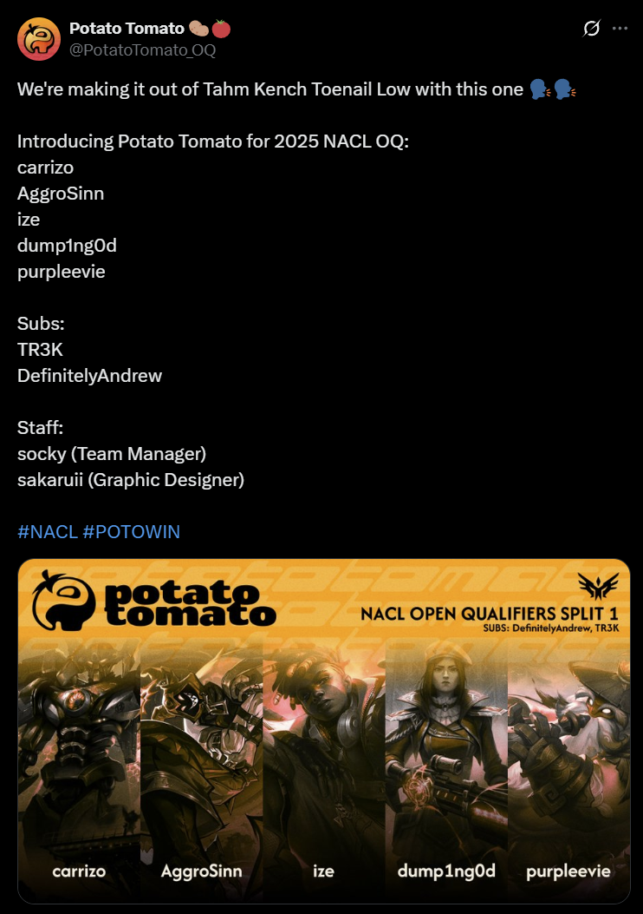

Following my previous year's collegiate e-sports escapades, I didn't think I'd be participating in any more competitive League of Legends for a while. That was, until a little "sock" came along and convinced myself + our group of (woefully underskilled) friends to sign up for a tournament; with the chance to directly qualify into the professional Tier 2 league. After all, did we have anything to lose?

## Context

To help explain the North American pro scene, let's use the NHL (or any other professional sports league) to compare. The best players in North America compete in the LTA North (NHL), which is a league of 8 teams that fight for the top spots to play in international tournaments (Stanley Cup Playoffs). The tier 2 developmental/farm league (AHL) is called the North American Challengers League, abbreviated NACL. There are typically 10 teams per season, but this year there are 7 with 3 open slots. To field rosters into these 3 slots, Riot Games (Gary Bettman) decided to hold a 64-seed tournament to find the top 3 teams; this tournament is the Open Qualifers (abbreviated OQ).

There is a minimum skill requirement for these types of tournaments. Since individually evaluating upwards of 64 * 5 = 320 players would take an incredibly long time, the minimum skill requirement is usually determined through your "soloq" ladder rank (climb the ladder by winning games). Now typically, the minimum rank is Diamond 1 (top ~1% of players, 1 million players total). For OQ though, this rank requirement was removed. Which meant that anyone could sign up, regardless of rank.

Of course, any sane person knows this is a serious tournament for serious players. After all, an opportunity to play on the professional stage is on the line. And the majority of teams consisted of high elo players, with an average rank of either Master or Grandmaster. Keyword: majority.

I've been consistently playing League with my friend group for about 3-4 years, where we mostly play for fun. We're all in fulltime school or on co-op so we don't grind the game very hard- our average rank is Emerald/Diamond. We have a little bit of competitive experience from random tournaments, but nothing substantial. So when our friend socky asked us to sign up, I actually dismissed it at first. We have virtually no competitive experience, we are massively underskilled, and we were probably all busy anyways (I would be playing on no practice because of midterms). But then I thought about it some more; what do we have to lose? If we lose, who cares. And it would be pretty funny if we beat the near impossible odds and won a game. So, on the premise of doing this for funsies, we assembled a team, came up with a team name and branding (we made a Twitter account!), and submitted our roster to the tournament organizer. Thus, POTO - Potato Tomato was born. 

## We're playing who?

After some shenanigans with the team signups (more than 64 teams signed up), we made the cutoff and POTO was officially seeded into the NACL OQ bracket as the 64th seed. I looked at our first round opponent, and the team name sounded familiar. The reason why? 

That team was Near Airport, a roster of legendary North American ex-pro players: TF Blade, Spica, Pobelter, Doublelift, and Biofrost. Their accolades include...

* [TF Blade](https://lol.fandom.com/wiki/TF_Blade) technically never played pro, but has hit the top rank in every single region across the world, and is widely regarded as one of the best players in NA.
* [Spica:](https://lol.fandom.com/wiki/Spica) 1 LCS title, 1 Worlds appearance. One of NA's most promising talents in recent years.
* [Pobelter:](https://lol.fandom.com/wiki/Pobelter) 3 LCS titles, 3 Worlds appearances. A le
* [Doublelift:](https://lol.fandom.com/wiki/Doublelift) 8 LCS titles, 8 Worlds appearances. As the most decorated LCS player, Doublelift is arguably NA's greatest player. He is one of my [favourite highlights of all time.](https://www.youtube.com/watch?v=n6c-wQmT8ww)
* [Biofrost:](https://lol.fandom.com/wiki/Biofrost) 4 LCS titles, 3 Worlds appearances.

It's not every day you get to meet your idols, let alone play against them in a professional match. Naturally, we were all excited (and scared of getting completely owned). But we weren't the only scared ones; Near Airport themselves were "scared". https://www.youtube.com/shorts/M0Kv_YNoV8c

And then out of nowhere, disaster strikes. A team has double registered, and the entire bracket is reseeded. POTO is now the 63rd seed, and will no longer be playing Near Airport. We now play Tempest Gaming, a roster of NACL-level players.

## Game day(s)