1A is over. And it certainly wasn't exactly what I expected it to be.

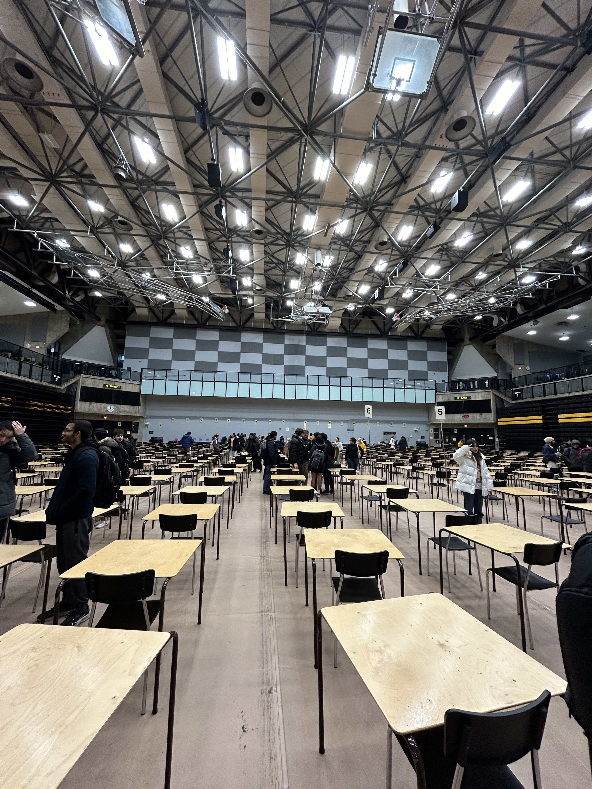

## Welcome to engineering

Everyone knows the "Waterloo" stereotype. The one where you have classes from 8:30am to 5:30pm and study until 2am everyday. Knowing a lot of friends who go to Waterloo, and knowing they were pretty smart, I assumed that I too would have to adjust my ways and adopt this grindset.

As I settled in, figuring out my schedule, meeting new people in my program, and gauging the workload... I actually struggled with finding homework to do at the start of the term. My math courses (calculus and linear algebra) just had weekly practice sets that you could do over the weekend. Calculus and physics had online assignments you could do in 2 hours the day they were due. Physics didn't even have a recommended practice set for the tutorials; it was kinda just look over the lecture slides, and do the online assessment as practice for the quiz.

As the term progresed, I found that the core courses (two maths, physics) maintained their rather minimal workload where as the other courses' workloads started to pick up. The first two coding projects were relatively easy and I finished them well ahead of time. Our open design course started up, where we had to make a project with an STM32 microcontroller board from scratch. Our communications class started giving out writing assignments. I had to apply to a lot of co-op positions. Needless to say, the work was starting to pile up. But I managed to get by without really changing my working habits.

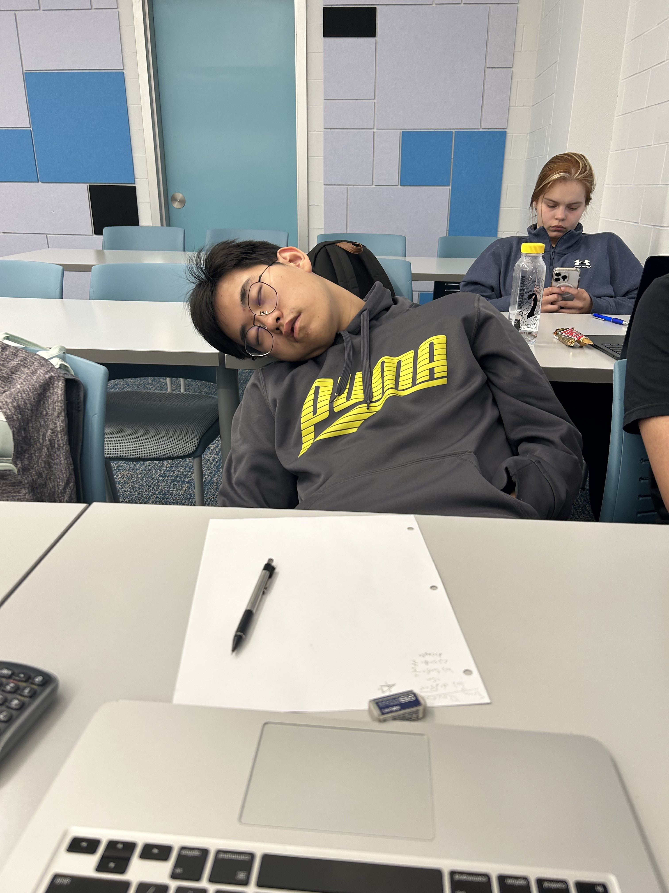

Then comes reading week, our week off before midterms. I brought home a classmate from BC so that he didn't have to stay in Waterloo. I showed him around York Region, and we tried to do some studying for midterms together, which didn't exactly pan out. He decided to go back to Waterloo, quoting "it was too much like home", which made it hard to do work.

Maybe he was right, because my midterm results were definitely subpar. I remember having a good laugh at my calculus midterm mark, knowing that it was my customary "Welcome to Waterloo Engineering" moment. But hey, at least I passed.

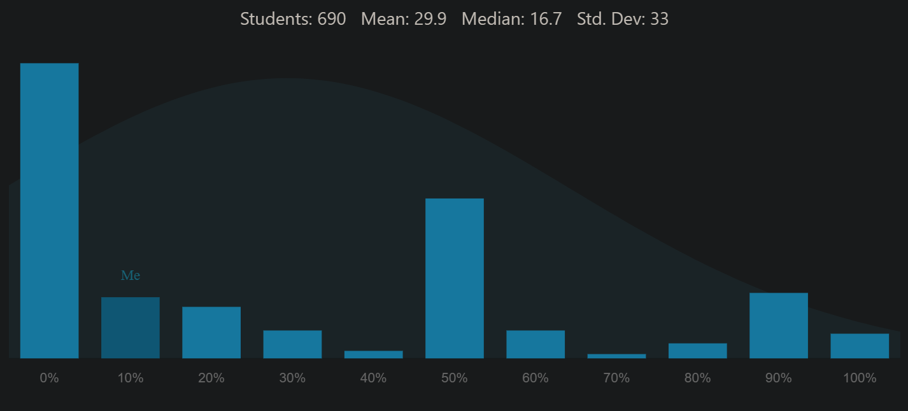

This was when I decided to make a shift towards that aforementioned stereotype, working harder than before the midterm. The content was getting harder too; linear algebra got a lot more abstract, we started integral calculus, and coding was moving on from the basics. I feel like the second half of the term passed a lot faster than the first half. That might be because I figured out a set weekly routine.

Two weeks before finals is when I seriously locked in. I separated days into two shifts: the afternoon shift was from 1pm till when I wanted dinner (usually 5 or 6pm), and the evening shift was from around 8pm to 1am. I basically did this everyday for 2-3 weeks, and stopped after my calculus final. Although I had one more final to go (physics), I was really burnt out. I also calculated that I had already passed the course without the final, but I like to think I would've studied if I didn't know I already passed.

")

I thought that every exam was pretty fair... but one. The CS final was 14 questions, each requiring fully fleshed out hand-written code solutions, all in under 2.5 hours. It was the only exam where people were definitely looking around at their peers in disbelief once we finished. We definitely receieved some department-wide curve, because there was no way I got a mid-70 on that exam after writing at least three solutions in quickly scribbled psuedocode.

I ended the term just shy of my target term average, which kinda sucked but was still good. I did much better this time around than midterms, was surprised at my better than expected calculus final, and will be baffled for at least months at how bad I did on my physics final (who saw this coming).

Overall, 1A had its challenges; but they weren't impossible. The Waterloo stereotype is true if you want to aim really high this term. But I managed to do just fine without the stereotype. I suspect I will have to lock in from the beginning of 1B, where everything is new content. But thats a problem after co-op.

## UW carrizo hits the rift

I was always aware of collegiate League of Legends. One of my elementary school friends had her brother play as the starting mid for UofT some years ago. But when I saw the postings for Waterloo Esports League tryouts, I didn't think all too much about it. The tier average for the second team was around Masters, I never grinded ranked (still am plat), and being in Engineering surely meant I didn't have time for this. As well, the only 5v5 competitive experience I had was consistently playing Clash for 3 years.

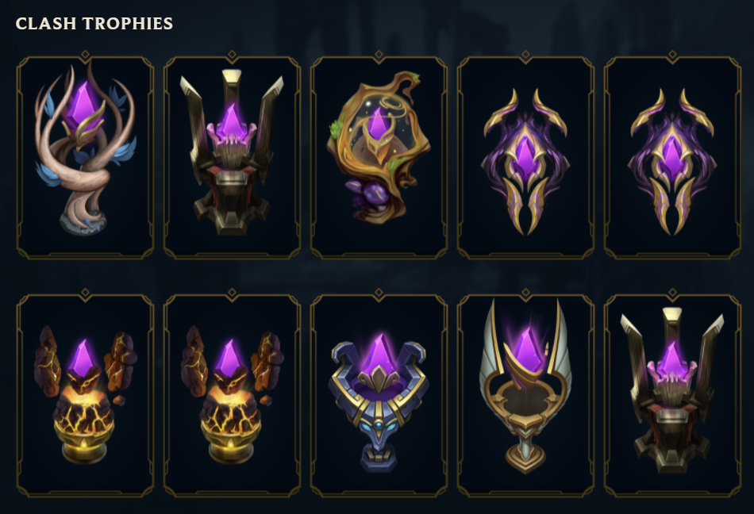

About a week before tryouts, my friend who I played with often and was also at Waterloo begged me to tryout, saying that he would only tryout if I did as well. The only thing holding me back was the $10 tryout fee, which I was really not trying to pay. To the rescue are some silly Americans that love ARAM who PayPaled me the $10. And so, I was signed up.

On the day of the tryout, I was all wired up and ready to go; only to find out that I would be playing in 1 game out of 3. And my opponent would be some random guy stuck in Silver. At this point, I thought it would be over for me; I didn't have a shot to prove my skill against a higher-ranked player. I waited the two hours by watching the other games, and won my game convincingly.

 is about top 25% of players, and Masters (tier 2 competitive average) is top 0.7%, all in the respective region. North America has about 1.6 million players in the ranked ladder.")

But I might've won a little too hard. Hard enough where after my game, the coaches messaged me to join a private call (which I didn't see for at least 15 minutes). I played so well in my game where the coaches thought I was smurfing, given that I had never climbed past Gold in my op.gg. To this I told them that I just never played ranked because of how terrible soloq is to play, and that I played a lot of Clash for the past few years. They told me that I was onto the second round, as well as my friend whom I asked to play with in this round.

In this second round, I was matched up against a Masters tank player. First game we lost, I got countered. Second game I countered him, and managed to beat him by a decent margin. With this, I ended the tryouts on a lot of uncertainty. I only played 2 champs, I'm plat and he's Master, how did the other players play (there were two games running concurrently), etc. Didn't help that they delayed the decision. Two days later, while shopping at Costco, I got an Outlook notification.

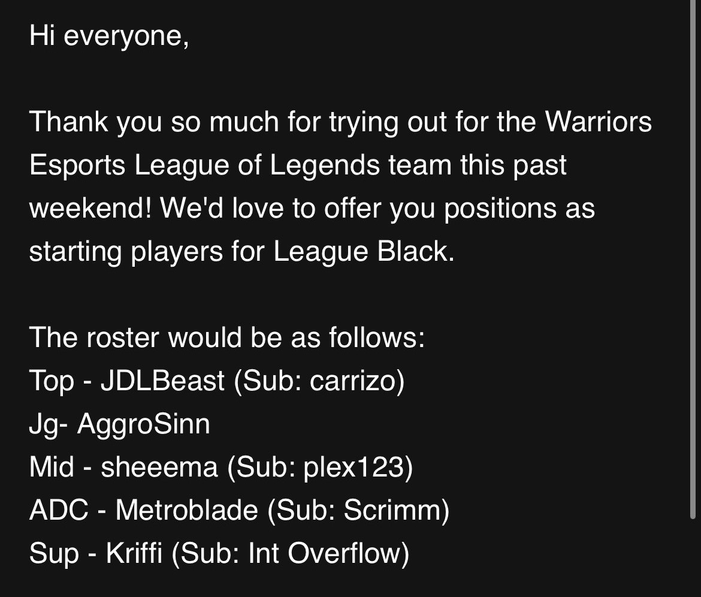

Although I'm at the very bottom of the barrel (League Black is the developmental team to League Gold + I'm not the starter), I was still on the team. And that felt pretty cool.

Throughout the term, I managed to play in a few scrims, and even played in a tournament match. Hell, I've managed to [solokill Challenger players](https://insights.gg/v/5mpbRq2yZ5m1s1xZEBTqew) (take my word they are Challenger). And I'm part of the small minority of League players that have managed to make some money ($20) off the game. My teammates are amazing, my coach is super chill, and playing competitive League is just so much fun. It's been an unexpected but wonderful experience so far, and I would love to continue playing collegiate e-sports throughout my undergrad.

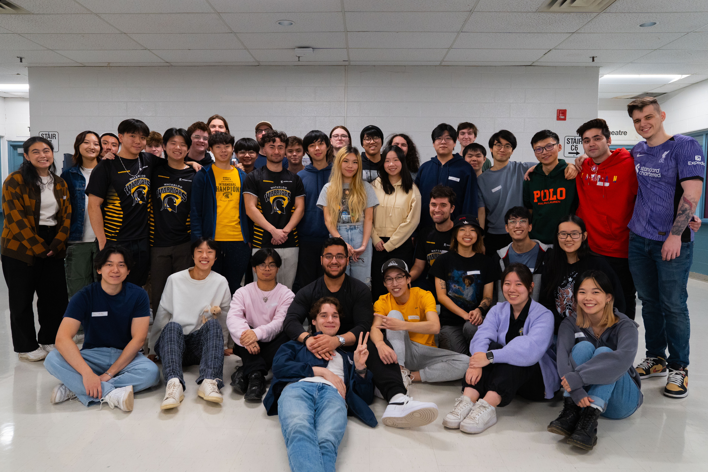

## Everything else

* I joined Electrium Mobility, a personal electric vehicle focused design team. I was on the e-scooter team, where I (questionably) soldered parts together. Shoutout to Damir for leading our team, and Sherwin who oversaw the entire design team (and helping me with 150).
* I met up with some elementary school friends and watched a Kitchener Rangers pre-season game. Making the trip down to The Aud was surprisingly easy, and OHL hockey is still good hockey to watch. Minds were blown over how some of the players were 2007 born.
* Intramural hockey was fun. I quickly found out that the competitive division meant AA/AAA players, and I hadn't played rep hockey in 5 years. I transferred to the semi-competitive division and found an old friend whom I walked to games with. Our team almost became intramural champions, but lost in the finals.
    * The CMH front desk let us borrow those move-in carts so we didn't have to carry our bags all the way to CIF.
* Cooking was pretty fun in my little kitchen. I can confidently say I only had two "struggle meals" throughout the entire term; and they were both because I had to clear out the fridge before leaving Waterloo.
* I joined DJ Club. I will never trash talk a DJ ever again. It is much, much harder than you think it is.
* I went to a couple Waterloo K-pop club events. They were great, and I even won a face mask for winning the "guess the dance" challenge.
    * We are missing a keyboard club. I may or may not start one up in the future.
* A special shoutout to my calculus professor Serge D'Alessio, who truly was the GOAT. Our cohort managed to go out for a dinner with him, where we all took pictures with him.

Below are some photos I collected over the term.


    <video class="grid-w33" controls>
        <source src="/posts/The-1A-Experience/soldering.mp4" alt="Me spot welding our scooter's battery together in Electrium." type="video/mp4">
    </video>
    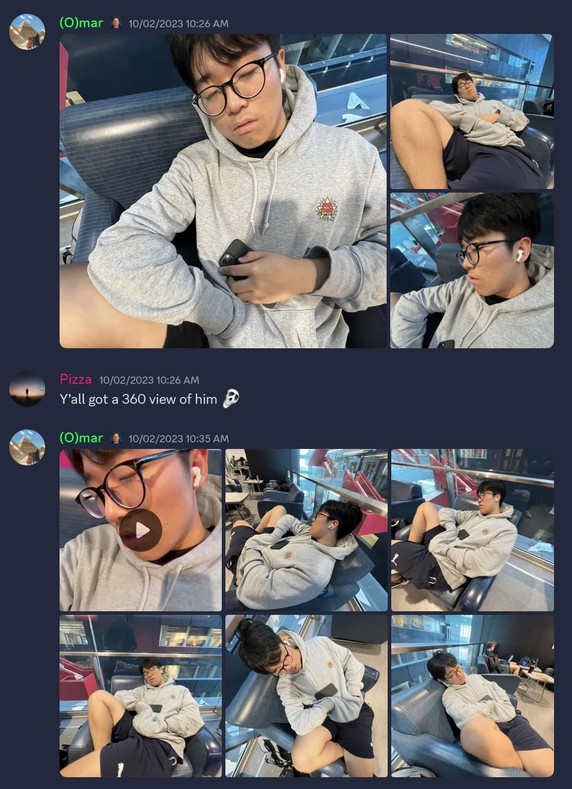
    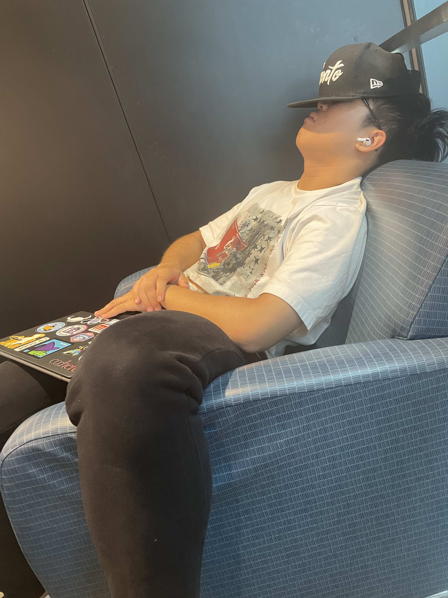
    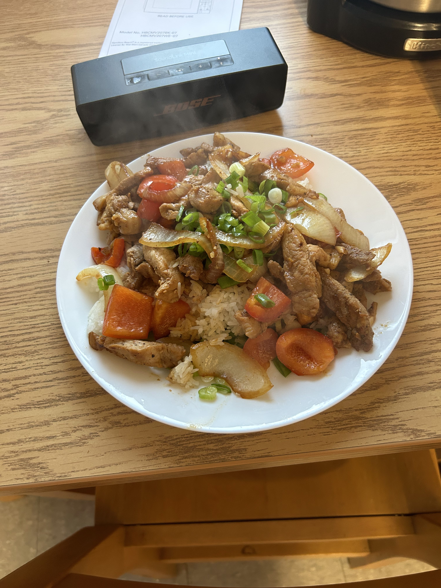
    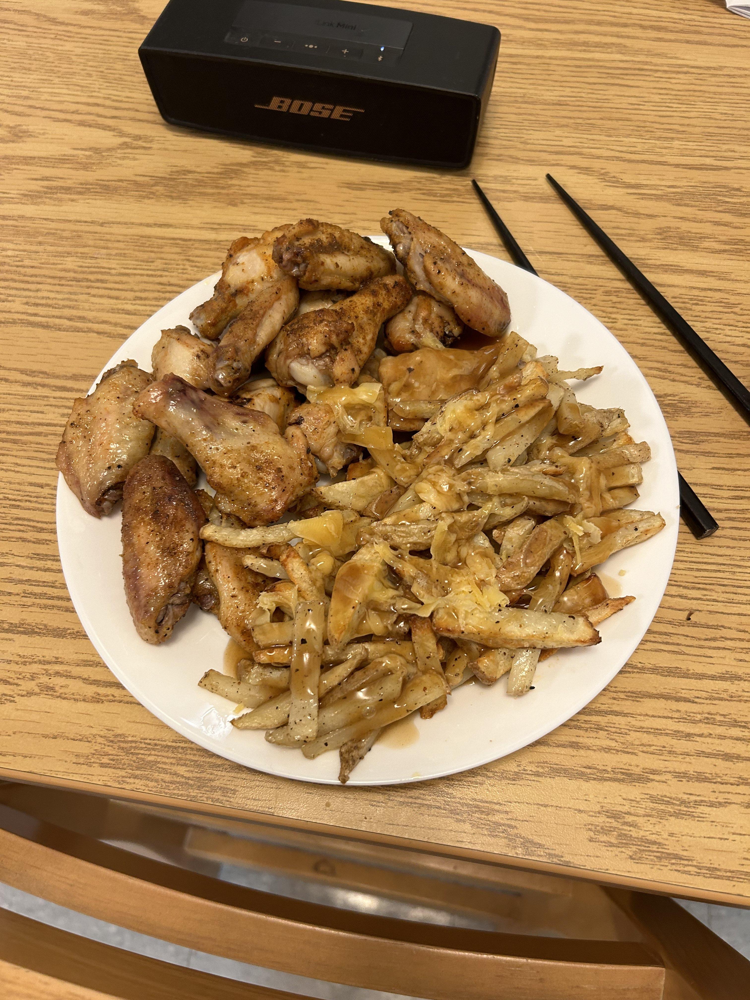
    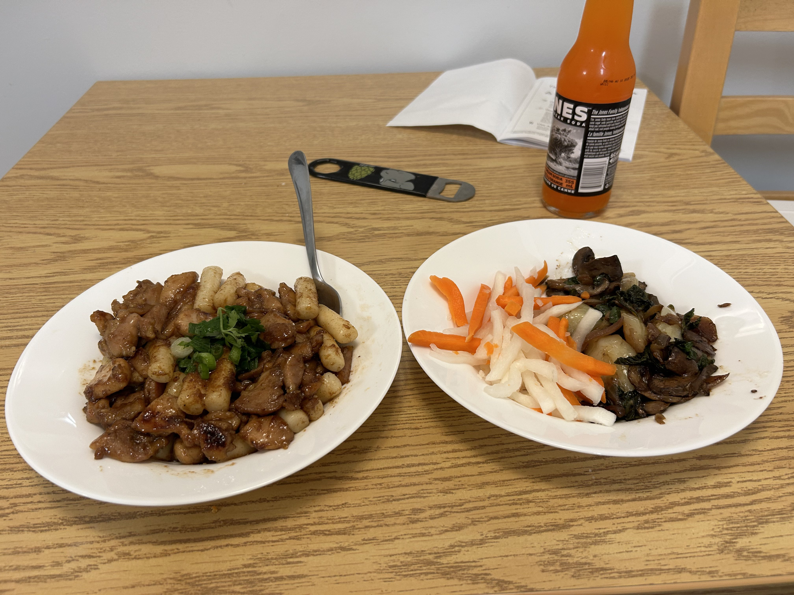
    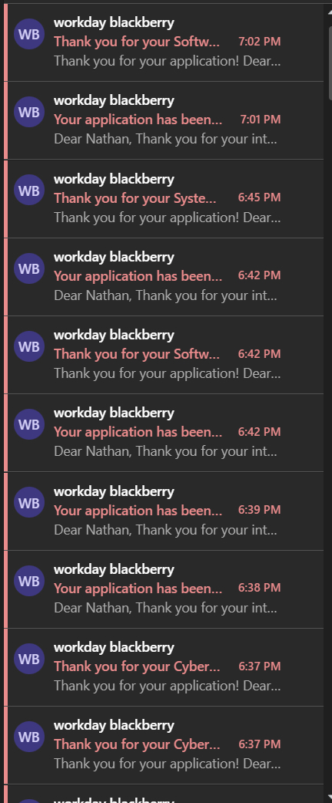
    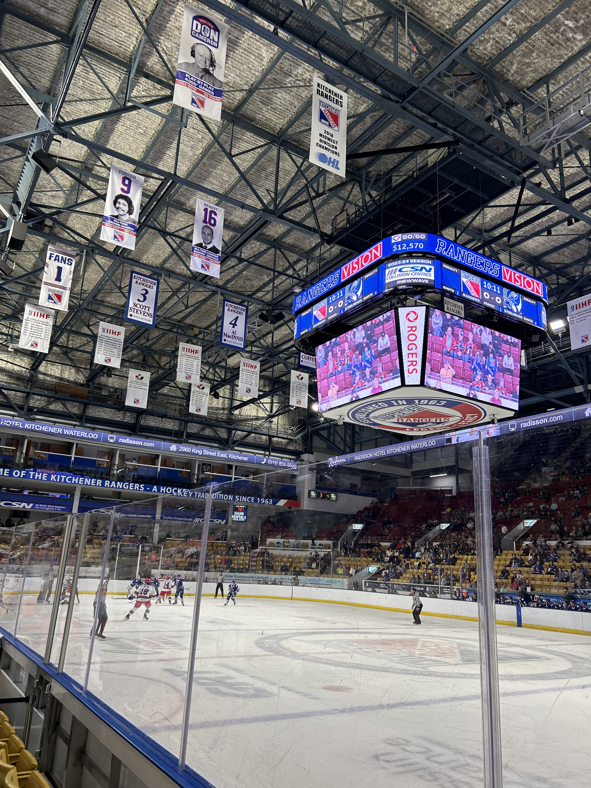
    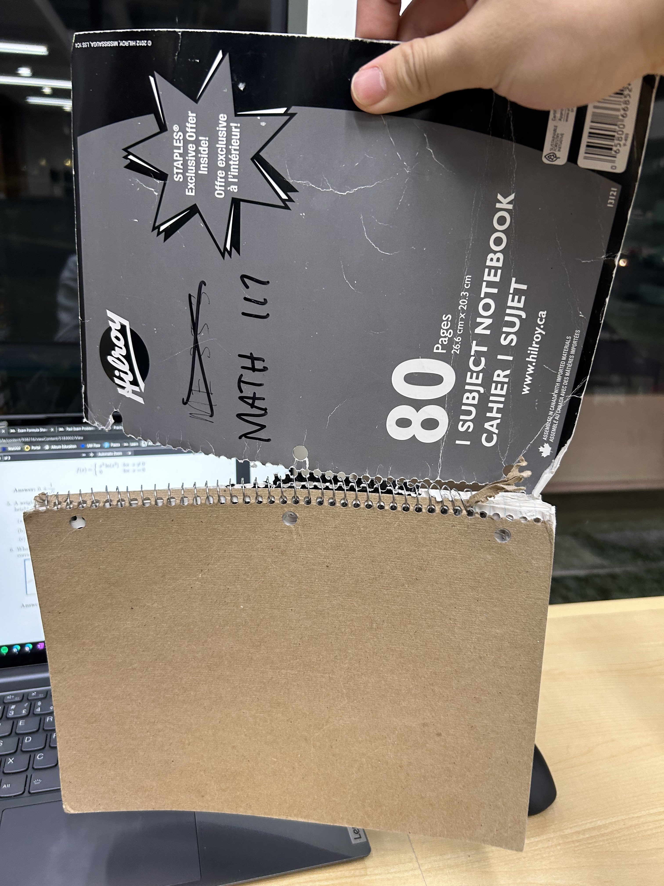
    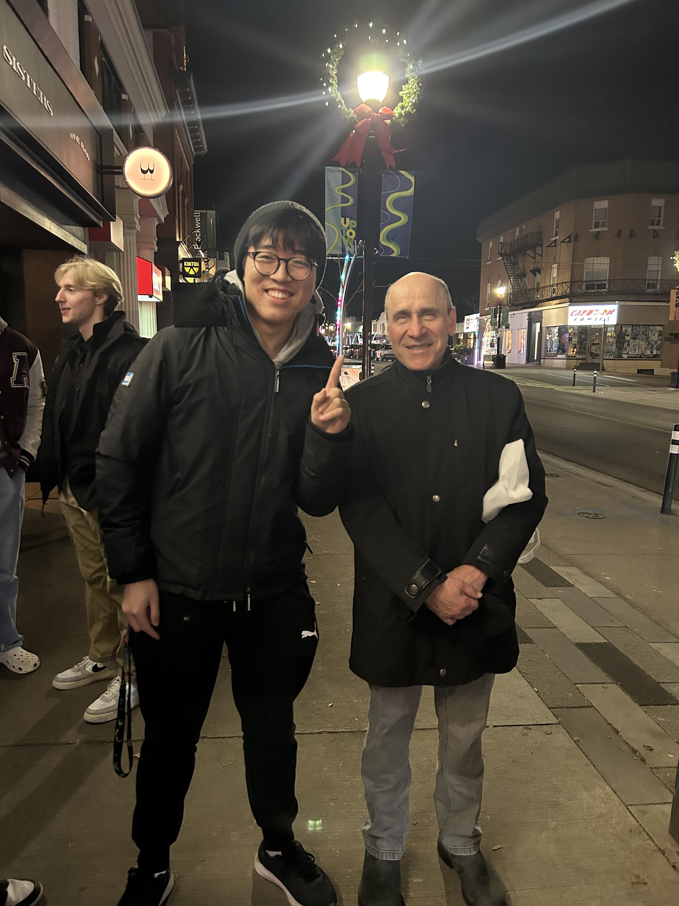
    


1A was an appropriate introduction to university. Let's see what 1B holds.
