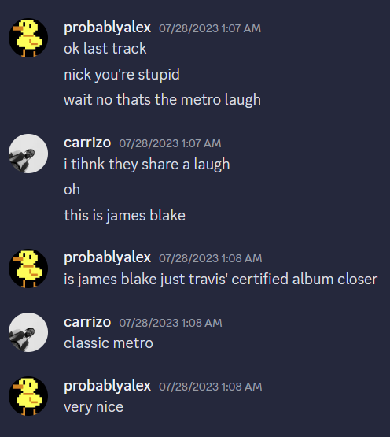

When word got out that Travis Scott would finally be dropping his long-awaited album "Utopia", I was almost convinced that he actually wouldn't be dropping it on that date. I had been hurt too many times.

It turns out that Travis wasn't lying. Together with Alex, here is a photo collection of our reactions to the first listen of Utopia. If you still haven't listened to Utopia, feel free to listen along with our reactions.

<!-- utopia-->

Not pictured: THANK GOD. I think it's the best song on the album.

Not pictured: DELRESTO (ECHOES). It was not very interesting.

Not pictured: PARASAIL. It was a nice interlude.

Not pictured: K-POP. We skipped it.

