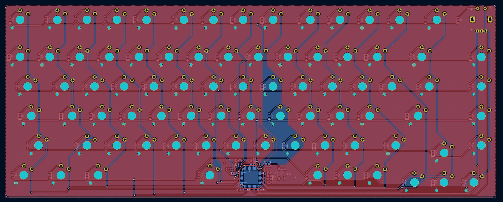

My portfolio that takes a technical dive into my PCB designs. If applicable, Github links are hyperlinked at the bottom of the project. Click on an image to expand it.

For some reason, sometimes the images will block the text; this is a Hugo issue, please refresh the page to fix it.

## Fine sun sensor





* Reverse engineered an existing fine sun sensor + magnetometer PCB design with only the gerbers and bill of materials to recreate the schematic
* Individually followed each copper trace on 6 layers to track component connections, piecing together all connections to fully understand the board's functionality
* Redesigned the board to better account for EMI affecting delicate photodiode signal
    * Updated improper 6-layer stackup to 8-layers, constructing a proper stackup with orthogonal trace routing
    * Opted for buried via usage for traces directly underneath the fine sun sensor
    * Isolated digital power plane from the rest of the board 
* To be manufactured and assembled by a factory

## Coarse sun sensor





* Architected, designed and assembled a coarse sun sensor PCB for use on a satellite, saving nearly 99% on production costs by designing in-house compared to purchasing from a third-party seller
* Amplifies the current output from photodiode using a transimpedance amplifier, then converts the signal to digital output with an ADC
* Communicated to satellite computer through I2C, which takes the combined outputs from all 8-9 sensor modules to determine the attitude/orientation of the satellite relative to the sun
* Manufactured the sensor completely in house, starting with a plain copper board, laser cutting out two modules and their electrical connections, finishing with a solder mask and low budget silkscreen, and carefully hand assembling the board
* To be manufacutured by a factory with a new connector

## E-skateboard remote control





* Designed and assembled the remote control for our carbon fibre skateboard e-vehicle, communicating with motor transciever via ESP32 microcontroller
* Remote control battery is charged through 5V, which is converted into 3.3V and protected with battery regulation
* Outputs board information (speed, motor gear, battery) to integrated LCD display via I2C
* Utilizes hall sensor input as speed control, with power button and general inputs button to change display output

## micarrizo pad





* Designed a custom 9-key macropad with rotary encoder for [The Big Switch by Kailh](https://novelkeys.com/products/the-big-switch-series), turning a gag gift into a functional product
* Powered by a Raspberry Pi RP2040, utilizing CircuitPython based KMK firmware for easy setup and customization
* Set keys to general function keys and used AutoHotkey to script keys to their intended functions, allowing for easy reconfiguration and functionality reassignment
* [Github repository](https://github.com/carrizo93/micarrizo-pad)

## In development: sg75





* Currently designing a low-profile 75% keyboard, choosing Kailh Chocolate switches instead of standard MX switches and looking to install hotswap capability
* Directly integrated ATmega32u4 into the PCB instead, keeping the USB-C output, and utilizing the C based QMK firmware to boost keyboard response time
* Plan on designing the keyboard case and plate in CAD from scratch, opting for an aluminum case to CNC instead of a 3D print for a further technical challenge
* Current status: finished PCB design, case design underway
* [Github repository](https://github.com/carrizo93/sg75)